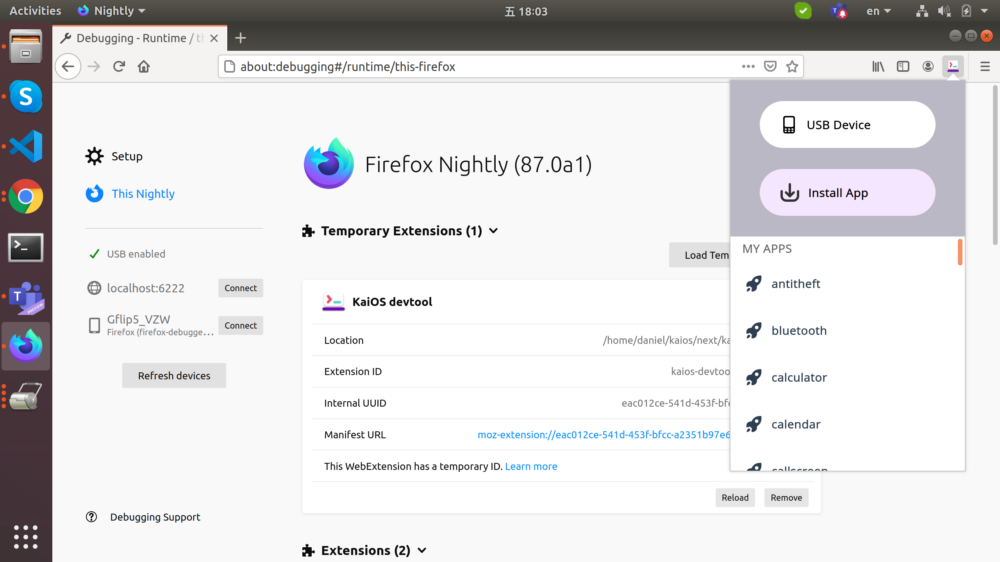

# KaiOS DevTool

A lightweight UI to install/uninstall & list apps.

## Requirements

1. Ubuntu (tested with 18.04)
2. Python (tested with 2.7)
3. Firefox nightly tested with 84.0b4

## Usage

1. Download latest artifact from <https://git.kaiostech.com/daniel.yang/kaios-devtool/pipelines> then unzip it.
    - Or clone this repo then execute `npm install && npm run build`.

2. ```sh
   cd dist
   bash app\install_native_app.sh
   ```

    For Windows please make sure python installed then execute following steps
    - Rename `message_host_win.json` to replace `message_host.json`
    - replace `%~dp0` inside `install_native_app.bat` and `message_host.bat` to valid path
    - execute `install_native_app.bat`

3. Make sure KaiOS device connected with `adb root`, seems appscmd crashes without this.

4. Open firefox nightly & go to page `about:debugging`

5. Click `This Firefox` on top left

6. Title `Temporary Extensions`, click `Load Temporary Add-on`, choose `manifest.json`.

7. Click "K" icon on toolbar.

## Snapshot

 For now the UI is really simple...


## Appendix

[1] Native Messaging
<https://developer.mozilla.org/en-US/docs/Mozilla/Add-ons/WebExtensions/Native_messaging>

[2] Native Manifest
<https://developer.mozilla.org/en-US/docs/Mozilla/Add-ons/WebExtensions/Native_manifests>

## Project setup

### Requirement

* node.js v12.20.0
* npm 6.14.8

### Install dependency

```sh
npm install
```

### Compiles and minifies for production

```sh
npm run build
```

### Lints and fixes files

```sh
npm run lint
```

### Customize configuration

See [Configuration Reference](https://cli.vuejs.org/config/).
